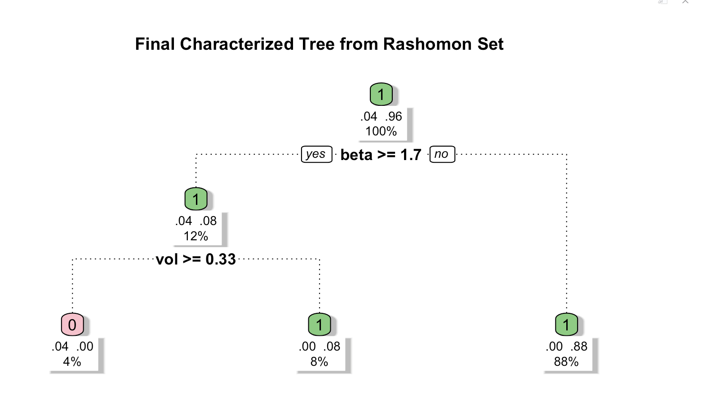

ROOT: Weighted Trees/Forests for ROOT-style Functional Optimization
================

<!-- badges: start -->

[](https://github.com/peterliu599/ROOT-R-Package/actions/workflows/R-CMD-check.yaml)
[](https://app.codecov.io/gh/peterliu599/ROOT-R-Package)
<!-- badges: end -->

> Rashomon-set Optimal Trees for interpretable functional optimization
> and treatment effect generalizability

------------------------------------------------------------------------

# Overview

**ROOT (Rashomon set of Optimal Trees)** is a **general functional
optimization framework** for learning interpretable binary weight
functions, represented as sparse decision trees.

At its core, ROOT searches over functions $w(X) \in \{0,1\}$ that assign
inclusion or exclusion weights to units based on their covariates $X$.
The optimization objective (or **loss function**) can be chosen to
reflect different scientific goals.

- **Framework flexibility:** By substituting different loss functions,
  ROOT can be applied to diverse settings.
- **Interpretability:** Solutions are restricted to sparse decision
  trees, ensuring outputs are human-readable and suitable for
  communication with collaborators.
- **Rashomon principle:** Rather than return a single solution, ROOT
  identifies a **Rashomon set** of near-optimal trees, highlighting
  multiple plausible explanations. A **characteristic tree** can then be
  extracted to summarize common patterns.

------------------------------------------------------------------------

## ROOT for generalizability

The original ROOT paper demonstrates this framework in the context of
**generalizing causal effects from randomized trials to a target
population**.

- **Problem:** Randomized trials are internally valid but often differ
  from the target population. If trial participants underrepresent
  certain effect-modifying subgroups, estimates of the **Target Average
  Treatment Effect (TATE)** can be imprecise or misleading.
- **Solution:** ROOT introduces a refined estimand, the **Weighted
  Target Average Treatment Effect (WTATE)**, defined over the subset of
  the population that is sufficiently represented.
  - Units are either included ($w(X) = 1$) or excluded ($w(X) = 0$)
    according to learned tree-structured rules.
  - The loss function is designed to minimize the variance of the
    estimator while retaining as much of the target population as
    possible.
- **Interpretation:** ROOT’s decision trees explicitly describe *who is
  underrepresented* and *why they are excluded*. The Rashomon set
  provides multiple, equally valid ways of describing these subgroups.

For a detailed worked example of ROOT in generalizability mode, see the
[`generalizability_path_example`
vignette](vignettes/generalizability_path_example.Rmd).

------------------------------------------------------------------------

## Installation

You can install the development version of `ROOT` from
[GitHub](https://github.com/) with:

``` r
# install.packages("devtools")
devtools::install_github("peterliu599/ROOT")
```

------------------------------------------------------------------------

## Example: Portfolio selection via variance minimization

ROOT can be applied to any optimization problem that can be expressed as
a binary inclusion/exclusion decision. In this example, we use ROOT to
select a **minimum-variance portfolio** from a universe of 100 simulated
assets, each characterized by its market beta and annualized volatility.
ROOT learns an interpretable tree-structured rule describing which
assets to include ($w = 1$) to minimize portfolio return variance.

``` r
library(ROOT)
set.seed(123)

n_assets <- 100

# Asset features
volatility <- runif(n_assets, 0.05, 0.40)  # annualised volatility
beta       <- runif(n_assets, 0.5,  1.8)   # market beta
sector     <- sample(c("Tech", "Finance", "Energy", "Health"),
                     n_assets, replace = TRUE)

# Simulate returns correlated with beta and volatility
market      <- rnorm(1000, 0.0005, 0.01)
returns_mat <- sapply(seq_len(n_assets), function(i)
  beta[i] * market + rnorm(1000, 0, volatility[i] / sqrt(252))
)
vsq <- apply(returns_mat, 2, var)  # per-asset return variance (objective)

dat_portfolio <- data.frame(
  vsq    = vsq,
  vol    = volatility,
  beta   = beta,
  sector = as.integer(factor(sector))
)

portfolio_fit <- ROOT(
  data        = dat_portfolio,
  num_trees   = 20,
  top_k_trees = TRUE,
  k           = 10,
  seed        = 123
)

summary(portfolio_fit) # for a full summary output
```

    ## ROOT object
    ##   Generalizability mode: FALSE 
    ## 
    ## Summary classifier (f):
    ## n= 100 
    ## 
    ## node), split, n, loss, yval, (yprob)
    ##       * denotes terminal node
    ## 
    ## 1) root 100 8 1 (0.0800000 0.9200000)  
    ##   2) vol>=0.3546479 14 6 0 (0.5714286 0.4285714)  
    ##     4) beta>=1.18087 8 0 0 (1.0000000 0.0000000) *
    ##     5) beta< 1.18087 6 0 1 (0.0000000 1.0000000) *
    ##   3) vol< 0.3546479 86 0 1 (0.0000000 1.0000000) *
    ## 
    ## Global objective function:
    ##   User-supplied: No (default objective used)
    ## 
    ## Diagnostics:
    ##   Number of trees grown: 20
    ##   Rashomon set size: 10
    ##   % observations with w_opt == 1: 92.0%

``` r
print(portfolio_fit) # for a brief summary print
```

    ## ROOT object
    ##   Generalizability mode: FALSE 
    ## 
    ## Summary classifier (f):
    ## n= 100 
    ## 
    ## node), split, n, loss, yval, (yprob)
    ##       * denotes terminal node
    ## 
    ## 1) root 100 8 1 (0.0800000 0.9200000)  
    ##   2) vol>=0.3546479 14 6 0 (0.5714286 0.4285714)  
    ##     4) beta>=1.18087 8 0 0 (1.0000000 0.0000000) *
    ##     5) beta< 1.18087 6 0 1 (0.0000000 1.0000000) *
    ##   3) vol< 0.3546479 86 0 1 (0.0000000 1.0000000) *

``` r
plot(portfolio_fit)
```

<!-- -->

The characterized tree recovers an intuitive and interpretable portfolio
construction rule. Assets with **beta \< 1.7** are included (88% of the
universe). Among the remaining high-beta **beta $\geq$ 1.7** assets,
those with **volatility $\geq$ 0.33** are excluded ($w = 0$, 4%), while
high-beta assets with **volatility \< 0.33** are retained (8%). Overall,
the final majority vote by the Rashomon set of 10 near-optimal trees
includes 96% of assets in the final and screens out only the most
risk-concentrated subset.

For a detailed worked example of ROOT in optimization mode, see the
[`optimization_path_example`
vignette](vignettes/optimization_path_example.Rmd).

------------------------------------------------------------------------

## Issues

If you encounter any bugs or have any specific feature requests, please
[file an issue](https://github.com/peterliu599/ROOT-R-Package/issues).

------------------------------------------------------------------------

## License

The contents of this repository are distributed under the MIT license.

------------------------------------------------------------------------

## Reference

Parikh, H., Ross, R. K., Stuart, E., & Rudolph, K. E. (2025). Who Are We
Missing?: A Principled Approach to Characterizing the Underrepresented
Population. *Journal of the American Statistical Association*, 120(551),
1414–1423. <https://doi.org/10.1080/01621459.2025.2495319>
