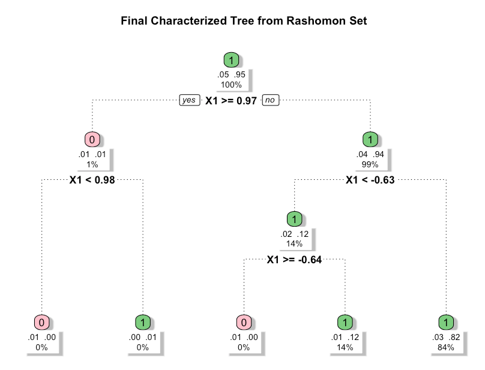

ROOT: Weighted Trees/Forests for ROOT-style Functional Optimization
================

<!-- badges: start -->

[](https://github.com/peterliu599/ROOT-R-Package/actions/workflows/R-CMD-check.yaml)
[](https://app.codecov.io/gh/peterliu599/ROOT-R-Package)

<!-- badges: end -->

> Rashomon-set Optimal Trees for interpretable functional optimization
> and treatment effect generalizability

---

# Overview

**ROOT (Rashomon set of Optimal Trees)** is a **general functional
optimization framework** for learning interpretable binary weight
functions, represented as sparse decision trees.

At its core, ROOT searches over functions $w(X) \in \{0,1\}$ that assign
inclusion or exclusion weights to units based on their covariates $X$.
The optimization objective (or **loss function**) can be chosen to
reflect different scientific goals.

- **Framework flexibility:** By substituting different loss functions,
  ROOT can be applied to diverse settings.
- **Interpretability:** Solutions are restricted to sparse decision
  trees, ensuring outputs are human-readable and suitable for
  communication with collaborators.
- **Rashomon principle:** Rather than return a single solution, ROOT
  identifies a **Rashomon set** of near-optimal trees, highlighting
  multiple plausible explanations. A **characteristic tree** can then be
  extracted to summarize common patterns.

---

## ROOT for generalizability

The original ROOT paper demonstrates this framework in the context of
**generalizing causal effects from randomized trials to a target
population**.

- **Problem:** Randomized trials are internally valid but often differ
  from the target population. If trial participants underrepresent
  certain effect-modifying subgroups, estimates of the **Target Average
  Treatment Effect (TATE)** can be imprecise or misleading.
- **Solution:** ROOT introduces a refined estimand, the **Weighted
  Target Average Treatment Effect (WTATE)**, defined over the subset of
  the population that is sufficiently represented.
  - Units are either included ($w(X) = 1$) or excluded ($w(X) = 0$)
    according to learned tree-structured rules.
  - The loss function is designed to minimize the variance of the
    estimator while retaining as much of the target population as
    possible.
- **Interpretation:** ROOT's decision trees explicitly describe *who is
  underrepresented* and *why they are excluded*. The Rashomon set
  provides multiple, equally valid ways of describing these subgroups.

For a detailed worked example of ROOT in generalizability mode, see the
[`generalizability_path_example`
vignette](vignettes/generalizability_path_example.Rmd).

---

## Installation

You can install the development version of `ROOT` from
[GitHub](https://github.com/) with:

``` r
# install.packages("devtools")
devtools::install_github("peterliu599/ROOT-R-Package")
```

---

## Example: General optimization — recovering an XOR subgroup

ROOT can be used for general functional optimization beyond
generalizability. In this example, the true optimal subgroup has an
**XOR structure**: units in the top-right quadrant ($X_1 > 0, X_2 > 0$)
and bottom-left quadrant ($X_1 < 0, X_2 < 0$) have higher signal, while
the other two quadrants do not. A single axis-aligned split cannot
capture this pattern — ROOT's tree ensemble is needed to identify it.

``` r
library(ROOT)
set.seed(123)

n  <- 200
X1 <- runif(n, -1, 1)
X2 <- runif(n, -1, 1)

# True optimal subgroup has XOR structure:
# top-right (X1 > 0, X2 > 0) and bottom-left (X1 < 0, X2 < 0)
true_w <- as.integer((X1 > 0 & X2 > 0) | (X1 < 0 & X2 < 0))
v      <- rnorm(n, mean = true_w, sd = 2)

dat_xor <- data.frame(v = v, X1 = X1, X2 = X2)

xor_fit <- ROOT(
  data        = dat_xor,
  num_trees   = 20,
  top_k_trees = TRUE,
  k           = 10,
  seed        = 42
)

print(xor_fit)
#> ROOT object
#>   Generalizability mode: FALSE
#>
#> Summary classifier (f):
#> n= 200
#>
#> node), split, n, loss, yval, (yprob)
#>       * denotes terminal node
#>
#> 1) root 200 10 1 (0.05000000 0.95000000)
#>   2) X1>=0.9705979 2  1 0 (0.50000000 0.50000000)
#>     4) X1< 0.9799107 1  0 0 (1.00000000 0.00000000) *
#>     5) X1>=0.9799107 1  0 1 (0.00000000 1.00000000) *
#>   3) X1< 0.9705979 198  9 1 (0.04545455 0.95454545)
#>     6) X1< -0.632322 29  4 1 (0.13793103 0.86206897)
#>       12) X1>=-0.6411189 1  0 0 (1.00000000 0.00000000) *
#>       13) X1< -0.6411189 28  3 1 (0.10714286 0.89285714) *
#>     7) X1>=-0.632322 169  5 1 (0.02958580 0.97041420) *
#>
#> Global objective function:
#>   User-supplied: No (default objective used)

plot(xor_fit)
```



The characterized tree assigns $w = 1$ to 95% of units, identifying the
high-signal region primarily through splits on $X_1$. With noise level
$\text{sd} = 2$, the XOR signal is subtle; ROOT's Rashomon set of 10
trees aggregates across multiple near-optimal partitions to produce a
stable characterization of the included subgroup.

---

## Issues

If you encounter any bugs or have any specific feature requests, please
[file an issue](https://github.com/peterliu599/ROOT-R-Package/issues).

---

## License

The contents of this repository are distributed under the MIT license.

---

## Reference

Parikh, H., Ross, R. K., Stuart, E., & Rudolph, K. E. (2025). Who Are
We Missing?: A Principled Approach to Characterizing the Underrepresented
Population. *Journal of the American Statistical Association*, 120(551),
1414–1423. <https://doi.org/10.1080/01621459.2025.2495319>
